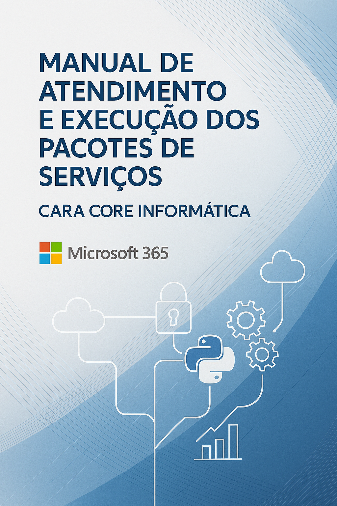
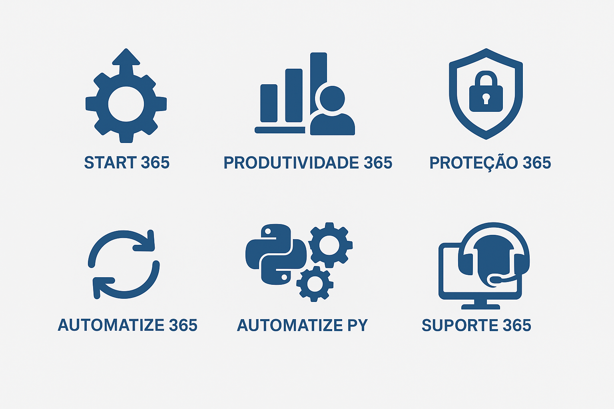

***

# Manual de Atendimento e Execução dos Pacotes de Serviços – Cara Core Informática

## Sumário

- [Manual de Atendimento e Execução dos Pacotes de Serviços – Cara Core Informática](#manual-de-atendimento-e-execução-dos-pacotes-de-serviços--cara-core-informática)
  - [Sumário](#sumário)
  - [Introdução](#introdução)
  - [Pacotes de Serviços Cara Core Informática](#pacotes-de-serviços-cara-core-informática)
    - [Pacote START 365 – Configuração e Implantação Inicial](#pacote-start-365--configuração-e-implantação-inicial)
    - [Pacote PRODUTIVIDADE 365 – Consultoria e Treinamento](#pacote-produtividade-365--consultoria-e-treinamento)
    - [Pacote PROTEÇÃO 365 – Segurança e Compliance](#pacote-proteção-365--segurança-e-compliance)
    - [Pacote AUTOMATIZE 365 – Power Platform e Eficiência](#pacote-automatize-365--power-platform-e-eficiência)
    - [Pacote AUTOMATIZE PY – Automação e Integração com Python](#pacote-automatize-py--automação-e-integração-com-python)
    - [Pacote TRANSFORMA 365 – Governança e Cultura Digital](#pacote-transforma-365--governança-e-cultura-digital)
    - [Pacote SUPORTE 365 – Suporte Técnico e Gestão](#pacote-suporte-365--suporte-técnico-e-gestão)
  - [Tabela Resumida de Pacotes e Investimentos](#tabela-resumida-de-pacotes-e-investimentos)
  - [Conclusão](#conclusão)
  - [Soluções Combinadas](#soluções-combinadas)
  - [Anexos](#anexos)
  - [Contato](#contato)

***

## Introdução

Este manual tem como objetivo fornecer diretrizes claras e práticas para a execução dos pacotes de serviços oferecidos pela Cara Core Informática, com foco na plataforma Microsoft 365. Destinado a técnicos, consultores e parceiros, o documento orienta sobre as melhores práticas de atendimento, implantação e suporte, garantindo uma experiência de qualidade para os clientes.

***

## Pacotes de Serviços Cara Core Informática

A Cara Core Informática oferece uma gama de pacotes de serviços para atender às necessidades específicas de cada cliente no ecossistema Microsoft 365. Nossos pacotes são projetados para proporcionar valor agregado, eficiência e segurança.



### Pacote START 365 – Configuração e Implantação Inicial

Este pacote é ideal para empresas que estão iniciando sua jornada no Microsoft 365. Inclui a configuração inicial, criação de contas, verificação de domínio e DNS, e ativação dos principais serviços como OneDrive, SharePoint e Teams.

- **Pré-requisitos do cliente:** Informar dados de domínio, acesso ao DNS, lista de usuários.
- **Checklist de implantação:**
  - Verificar domínio e DNS
  - Criar contas de usuário
  - Configurar licenciamento
  - Ativar MFA
  - Configurar OneDrive, SharePoint e Teams
  - Documentação entregue (PDF, vídeo, apostila)
- **Termo de aceite:** Formalizar a conclusão da implantação com o cliente.
- **Modelo de entrega:** Relatório de implantação com checklist e orientações.

### Pacote PRODUTIVIDADE 365 – Consultoria e Treinamento

Este pacote visa aumentar a produtividade dos usuários através de consultoria, organização de ambientes e treinamento prático. Ideal para empresas que já utilizam o Microsoft 365, mas precisam de ajuda para otimizar seu uso.

- **Levantamento de processos internos:** Entender como os usuários trabalham e quais são suas necessidades.
- **Organização de ambientes:** Estruturar Teams, SharePoint e OneDrive para facilitar o acesso e a colaboração.
- **Treinamento prático:** Capacitar os usuários nas ferramentas do Microsoft 365, com foco em suas atividades diárias.
- **Documentação:** Entrega de apostilas e certificados de participação.
- **Plano de ação:** Definir melhorias e próximos passos com base no feedback dos usuários.

### Pacote PROTEÇÃO 365 – Segurança e Compliance

Este pacote é voltado para empresas que buscam garantir a segurança dos dados e a conformidade com legislações como a LGPD. Inclui diagnósticos de segurança, configuração de políticas de proteção e backup.

- **Diagnóstico de segurança:** Avaliar o ambiente atual e identificar vulnerabilidades.
- **Políticas de proteção:** Implementar políticas de segurança, como DLP e MFA.
- **Backup:** Configurar soluções de backup para dados críticos.
- **Compliance:** Auxiliar na adequação à LGPD e outras regulamentações.
- **Relatório técnico:** Entregar um relatório detalhado com as ações realizadas e recomendações.

### Pacote AUTOMATIZE 365 – Power Platform e Eficiência

Este pacote foca na automação de processos e na criação de soluções personalizadas utilizando a Power Platform. Ideal para empresas que buscam eficiência operacional e redução de tarefas manuais.

- **Levantamento de processos manuais:** Identificar tarefas repetitivas que podem ser automatizadas.
- **Automação com Power Automate:** Criar fluxos de trabalho automáticos para simplificar processos.
- **Desenvolvimento de aplicativos:** Utilizar Power Apps para criar soluções internas personalizadas.
- **Dashboards com Power BI:** Desenvolver relatórios e visualizações de dados para tomada de decisão.
- **Testes e homologação:** Validar as soluções com usuários-chave antes da implementação final.
- **Documentação técnica:** Entregar guias de uso e manutenção das soluções criadas.

### Pacote AUTOMATIZE PY – Automação e Integração com Python

Este pacote é voltado para empresas que desejam utilizar Python para automatizar processos, integrar sistemas e gerar relatórios personalizados. Ideal para equipes técnicas que buscam eficiência e flexibilidade.

- **Mapeamento de tarefas repetitivas:** Identificar processos que podem ser automatizados com scripts Python.
- **Desenvolvimento de scripts Python:** Criar scripts para automação de tarefas e integração de sistemas.
- **Integração de sistemas:** Conectar diferentes sistemas e plataformas utilizando APIs e bibliotecas Python.
- **Geração de relatórios personalizados:** Criar relatórios e dashboards utilizando bibliotecas como Pandas e Matplotlib.
- **Treinamento e documentação:** Capacitar a equipe no uso de scripts Python e fornecer documentação técnica.
- **Testes e homologação:** Realizar testes com usuários-chave para validar as automações.
- **Suporte e manutenção:** Oferecer suporte contínuo para as automações implementadas.

### Pacote TRANSFORMA 365 – Governança e Cultura Digital

Este pacote é destinado a empresas que desejam estabelecer uma governança digital sólida e promover uma cultura de uso eficiente do Microsoft 365. Inclui a padronização de processos, criação de políticas internas e revisão periódica.

- **Diagnóstico de maturidade digital:** Avaliar o nível de adoção e uso do Microsoft 365 na empresa.
- **Padronização de uso:** Definir nomenclaturas, estruturas e boas práticas para Teams, SharePoint e OneDrive.
- **Criação de políticas internas:** Desenvolver manuais e diretrizes de uso seguro e eficiente.
- **Revisões periódicas:** Planejar reuniões regulares para avaliar o uso e propor melhorias.
- **Entregáveis:** Documentação completa com políticas, fluxos e recomendações.

### Pacote SUPORTE 365 – Suporte Técnico e Gestão

Este pacote oferece suporte técnico contínuo e gestão do ambiente Microsoft 365, garantindo que os usuários tenham assistência sempre que necessário e que o ambiente esteja sempre atualizado e seguro.

- **Abertura de chamados:** Registro e classificação de solicitações de suporte.
- **Suporte remoto e presencial:** Atendimento técnico para resolução de problemas e dúvidas.
- **Gestão de licenças e usuários:** Controle de acessos, permissões e renovações de licenças.
- **Monitoramento de segurança:** Acompanhamento de alertas e conformidade do ambiente.
- **Relatório mensal:** Entrega de um relatório com as atividades realizadas, chamados atendidos e novidades do Microsoft 365.
- **Atualizações de segurança:** Informações sobre as últimas atualizações de segurança e compliance do Microsoft 365.
- **Modelo de suporte:** Pode ser contratado de forma recorrente mensal ou em pacotes de horas.

## Tabela Resumida de Pacotes e Investimentos

```markdown
|-------------------|-------------------------------------------------------------|---------------------|
| Pacote            | Descrição Resumida                                          | Investimento        |
|-------------------|-------------------------------------------------------------|---------------------|
| START 365         | Implantação inicial, configuração e orientações básicas     | Sob consulta        |
| PRODUTIVIDADE 365 | Consultoria, organização e treinamento operacional          | Sob consulta        |
| PROTEÇÃO 365      | Segurança, backup, compliance e adequação à LGPD            | Sob consulta        |
| AUTOMATIZE 365    | Automação de processos, apps e integrações                  | Sob consulta        |
| AUTOMATIZE PY     | Automação, integração de sistemas e relatórios com Python   | Sob consulta        |
| TRANSFORMA 365    | Governança digital, padronização e políticas internas       | Sob consulta        |
| SUPORTE 365       | Suporte técnico, gestão do ambiente e atualizações          | Sob consulta        |
|-------------------|-------------------------------------------------------------|---------------------|
```

## Conclusão

Este manual apresenta de forma clara e detalhada todos os pacotes de serviços Microsoft 365 oferecidos pela Cara Core Informática, incluindo soluções de automação avançada com Python. Ao seguir as diretrizes, procedimentos e boas práticas descritos, garantimos um atendimento de excelência, segurança, produtividade e inovação para nossos clientes.

A estrutura modular dos pacotes permite a personalização conforme as necessidades de cada empresa, promovendo integração, governança digital e suporte contínuo. Recomendamos a revisão periódica deste manual para acompanhar as atualizações tecnológicas e manter a qualidade dos serviços prestados.

Conte com a Cara Core Informática para transformar o uso do Microsoft 365 em sua organização, potencializando resultados e promovendo uma cultura digital eficiente e segura.

## Soluções Combinadas

Os pacotes de serviços da Cara Core Informática foram desenvolvidos para serem complementares e flexíveis, permitindo a combinação de diferentes soluções conforme as necessidades específicas de cada empresa. É possível contratar um ou mais pacotes de forma integrada, potencializando resultados e otimizando investimentos.

Por exemplo, sua empresa pode iniciar com o Pacote START 365 para implantação inicial, avançar para o PRODUTIVIDADE 365 para capacitação dos usuários, e adicionar o PROTEÇÃO 365 para garantir segurança e compliance. Para automação de processos, é possível optar pelo AUTOMATIZE 365 (Power Platform) ou pelo AUTOMATIZE PY (Python), conforme o perfil técnico e os objetivos do projeto.

A combinação dos pacotes permite criar projetos sob medida, promovendo integração, eficiência operacional, governança digital e suporte contínuo. Nossa equipe está pronta para orientar na escolha das melhores soluções e personalizar o atendimento conforme o cenário de cada cliente.

## Anexos

- **Links úteis:**  
  Lista de links para documentação oficial da Microsoft, tutoriais, fóruns de suporte e comunidades técnicas relevantes para Microsoft 365, Power Platform e automação com Python.

- **Ferramentas recomendadas:**  
  Relação de softwares e utilitários indicados para administração, automação, backup e monitoramento do ambiente Microsoft 365, incluindo ferramentas para Power Platform (Power Automate, Power Apps, Power BI), scripts PowerShell, Azure AD Connect, Veeam, Acronis e ambientes para desenvolvimento Python (VS Code, Jupyter, bibliotecas como Pandas, Matplotlib, etc).

- **Referências técnicas da Microsoft:**  
  Guias, whitepapers, artigos e melhores práticas publicados pela Microsoft para implantação, segurança, automação, integração e governança do Microsoft 365.

- **Modelos e templates:**  
  Arquivos editáveis e exemplos de checklists, termos de aceite, políticas internas, roteiros de treinamento, templates de relatórios e diagnósticos, além de exemplos de scripts Python e fluxos Power Automate, disponíveis para download e adaptação conforme a necessidade do cliente.

## Contato

Para mais informações sobre os pacotes de serviços ou para solicitar uma consultoria personalizada, entre em contato conosco:

- **E-mail:** [suporte@caracore.com.br](mailto:suporte@caracore.com.br)  
- **WhatsApp:** [+55 (41) 99909-7797](https://wa.me/5541999097797)
- **Site:** [www.caracore.com.br](https://www.caracore.com.br)

Nossa equipe está à disposição para ajudar sua empresa a aproveitar ao máximo o Microsoft 365 e as soluções de automação oferecidas.
